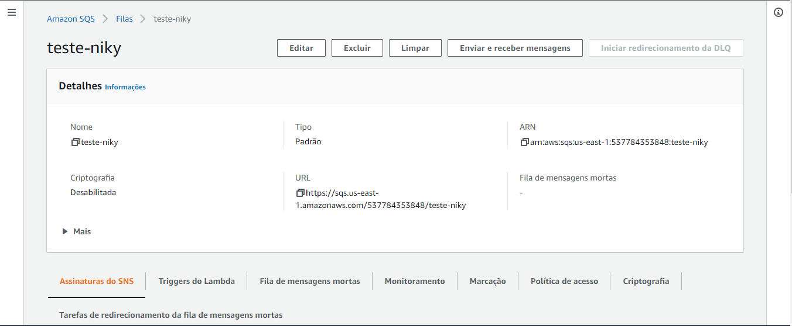
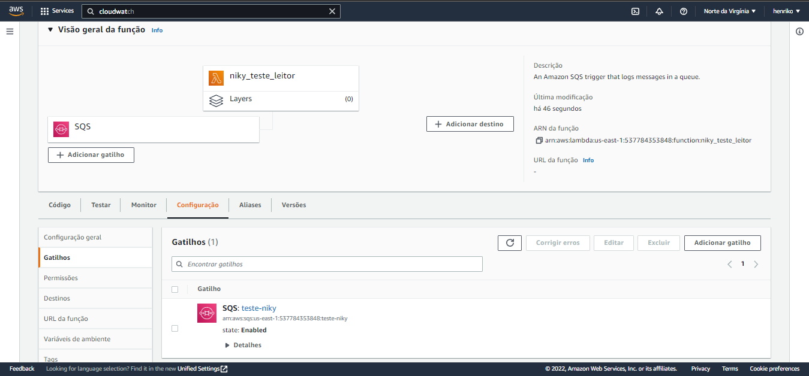
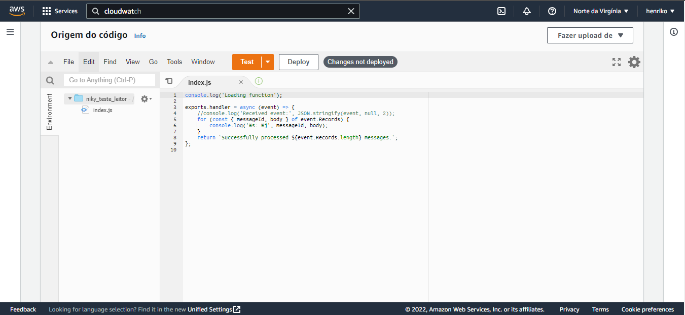
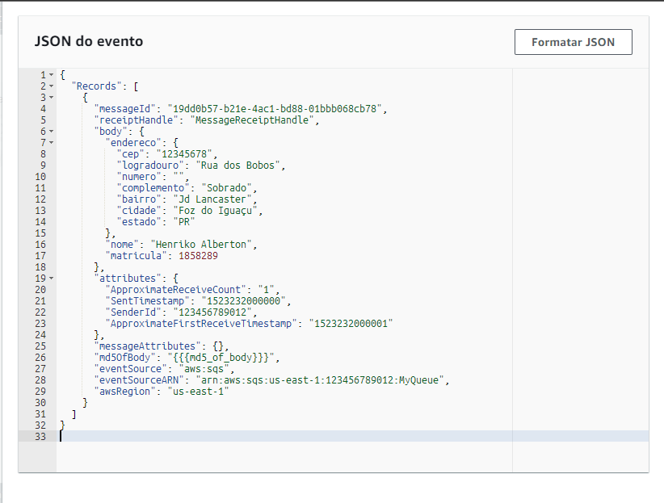
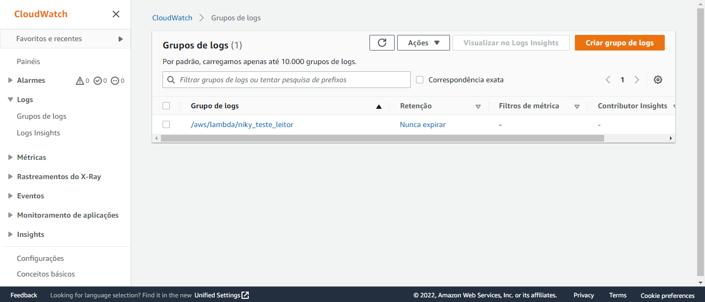
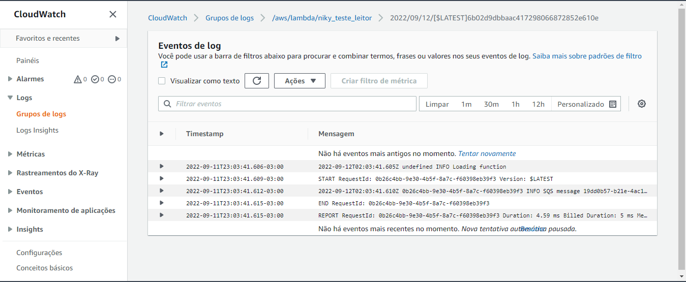
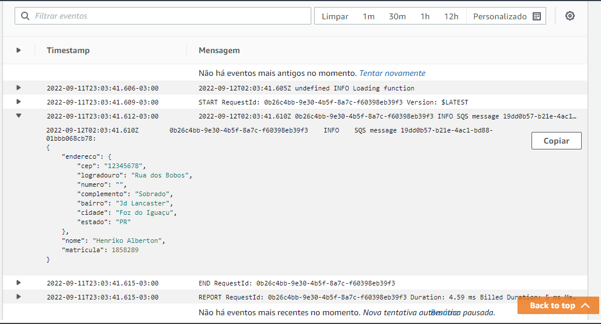
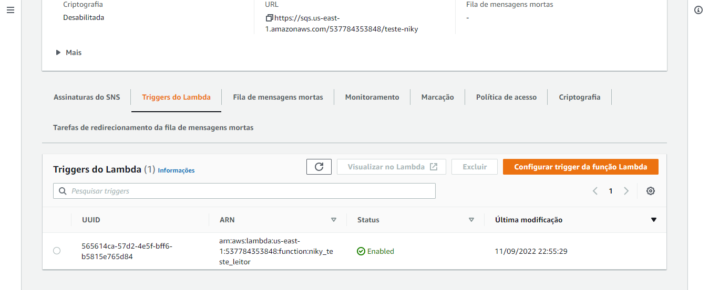

# Criação da Fila SQS

Antes de começar a usar o lambda é necessário criar uma Simple Queue Service (SQS) para que o lambda possa consumir as mensagens que serão enviadas para a fila.

O processo é bem simples, não precisa de nenhuma configuração tão avançada assim para poder testar, porém, obviamente num cenário de produção a configuração vai ser bem extensa.



# Criação do Lambda

Agora que já temos a fila criada, vamos criar o lambda que irá consumir as mensagens da fila.
Como se trata de um exemplo simples, seguimos uma blueprint que o próprio AWS Lambda nos disponibiliza, o "sqs-poller", que simplesmente vai ler as mensagens da fila e imprimir no log do lambda.

O resultado vai ser algo parecido com isso:


E o código de teste vai ser:


Podemos ver que é algo bem simples, só para testar e mostrar os conhecimentos.

# Teste

Após criar o lambda, vamos testar se ele está funcionando corretamente.
Para isso, vamos criar uma mensagem na fila e ver se o lambda está consumindo a mensagem corretamente.

o json que vamos enviar para a fila está disponível em `testEvent.json`, ou abaixo:

```json
{
  "Records": [
    {
      "messageId": "19dd0b57-b21e-4ac1-bd88-01bbb068cb78",
      "receiptHandle": "MessageReceiptHandle",
      "body": {
        "endereco": {
          "cep": "12345678",
          "logradouro": "Rua dos Bobos",
          "numero": "",
          "complemento": "Sobrado",
          "bairro": "Jd Lancaster",
          "cidade": "Foz do Iguaçu",
          "estado": "PR"
        },
        "nome": "Henriko Alberton",
        "matricula": 1858289
      },
      "attributes": {
        "ApproximateReceiveCount": "1",
        "SentTimestamp": "1523232000000",
        "SenderId": "123456789012",
        "ApproximateFirstReceiveTimestamp": "1523232000001"
      },
      "messageAttributes": {},
      "md5OfBody": "{{{md5_of_body}}}",
      "eventSource": "aws:sqs",
      "eventSourceARN": "arn:aws:sqs:us-east-1:123456789012:MyQueue",
      "awsRegion": "us-east-1"
    }
  ]
}
```

Veja como ele se parece no console do lambda:



# CloudWatch

Para monitorar o lambda, podemos usar o CloudWatch, sendo um serviço da AWS para monitoria de logs e etc.



Podemos agora acessar nosso grupo de logs do lambda e ver o log, que foi gerado pelo mesmo.



E acessando o log , podemos ver o que foi impresso no console do lambda.



E também podemos observar todos os triggers que a fila SQS possui, como por exemplo o lambda que criamos.


